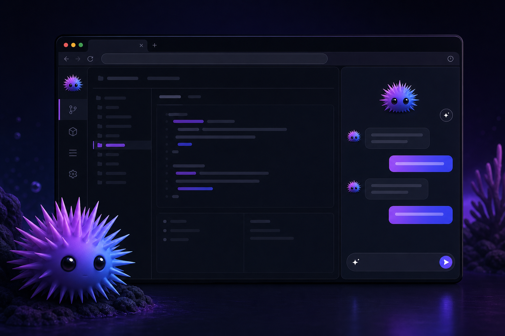
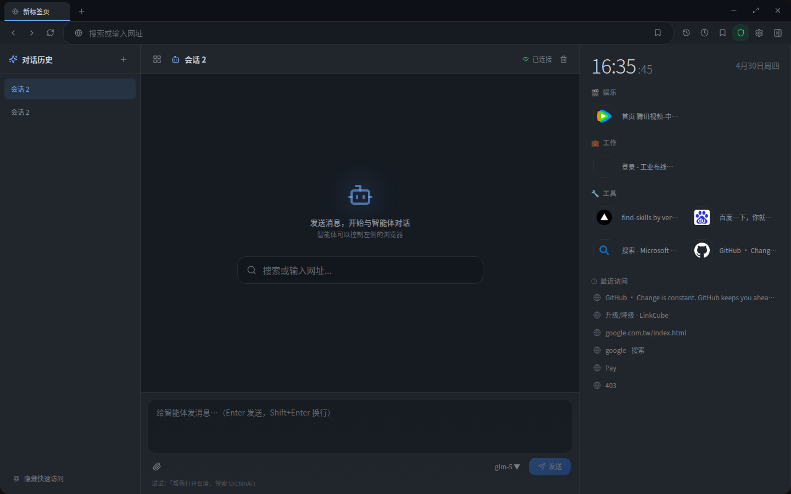
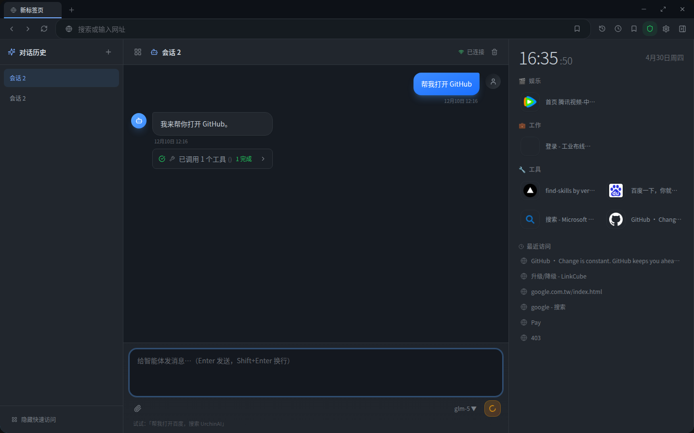
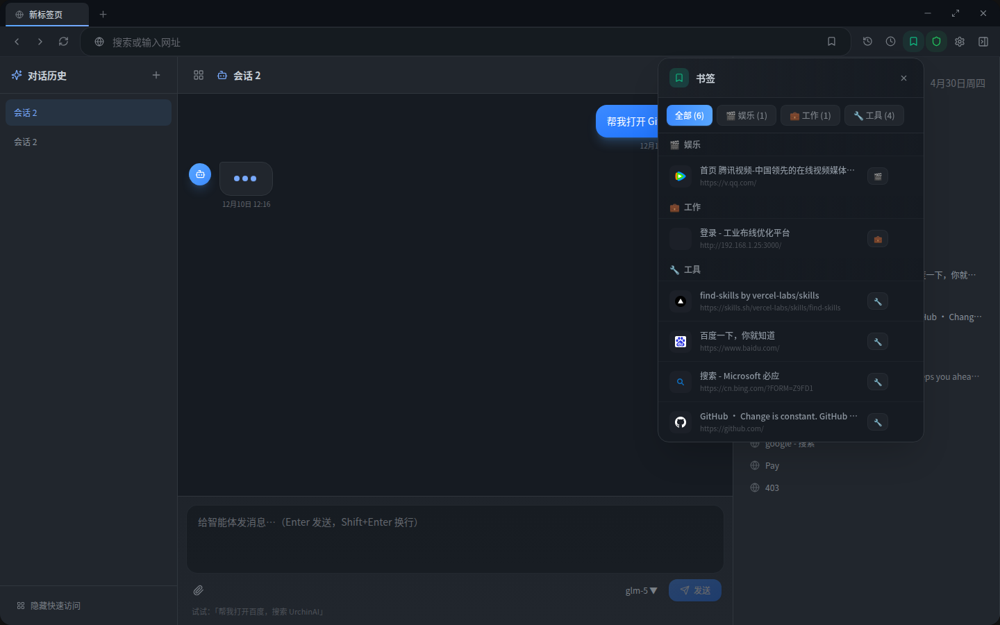
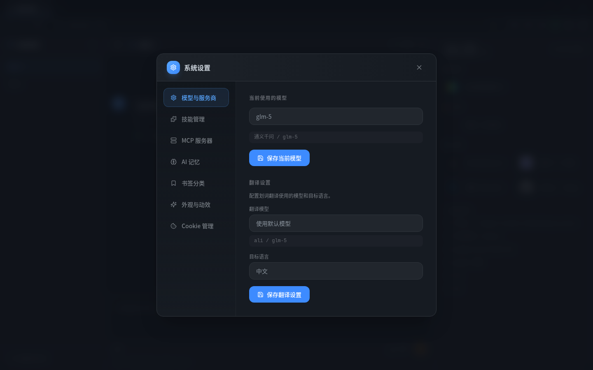
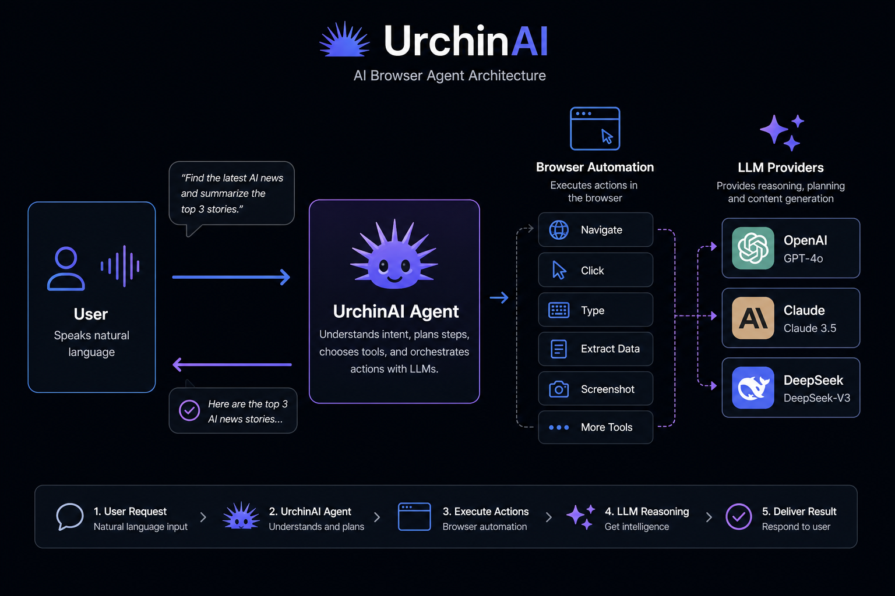

<div align="center">


# UrchinAI

**Open-Source AI Desktop Browser · Control the Web with Natural Language**

[](https://opensource.org/licenses/MIT)
[](https://github.com/DLbury/UrchinAI/releases)
[](https://github.com/DLbury/UrchinAI/releases)
[](https://www.electronjs.org/)

[English](README.md) · [中文](README.zh-CN.md)



**"Open GitHub, search for React projects, and organize the top 10 popular repositories"** — AI handles it automatically

[⬇ Download Latest Release](https://github.com/DLbury/UrchinAI/releases) · [📖 Quick Start](#quick-start) · [🛠 Build from Source](#for-developers)

</div>

---

> **UrchinAI** is a free, open-source **AI browser** and **browser automation agent** for Windows and Linux. Describe tasks in plain English — search, scrape, fill forms, compare prices, summarize pages — and the AI agent drives the browser for you. A privacy-first, self-hosted alternative to closed AI browsers like Atlas, with **15+ LLM providers** (OpenAI, Claude, DeepSeek, Gemini, Kimi, GLM, and more).

## Table of Contents

- [What is UrchinAI?](#what-is-urchinai)
- [Screenshots](#screenshots)
- [Key Features](#key-features)
- [How It Works](#how-it-works)
- [Use Cases](#use-cases-by-role)
- [Quick Start](#quick-start)
- [Usage Examples](#usage-examples)
- [Why UrchinAI?](#why-urchinai)
- [For Developers](#for-developers)
- [Roadmap](#roadmap)
- [FAQ](#faq)
- [Contributing](#contributing)

---

## What is UrchinAI?

**UrchinAI** is an AI-powered desktop browser built with Electron, React, and Python. Instead of clicking through menus or writing automation scripts, you tell the AI what you want — it navigates pages, extracts data, fills forms, and returns structured results.

Whether you are a developer researching APIs, a marketer running competitor analysis, a student gathering sources, or anyone tired of repetitive web tasks, UrchinAI turns natural language into **browser automation**.

| Scenario | Just Say | AI Completes |
|----------|----------|--------------|
| **Daily Browsing** | "Open Amazon and search for mechanical keyboards" | Navigate → Search → Display results |
| **Information Gathering** | "Find today's tech news and summarize it" | Search → Scrape → Summarize |
| **Form Filling** | "Help me fill out this registration form" | Recognize fields → Smart fill |
| **Data Extraction** | "Convert this table data to Markdown" | Extract → Format → Output |
| **Web Analysis** | "What is this page mainly about?" | Analyze → Summarize → Answer |
| **Research** | "Search for recent AI papers on arXiv" | Navigate → Search → Extract |
| **Shopping** | "Compare prices for this laptop across sites" | Multi-site search → Price comparison |
| **Content Creation** | "Gather information for a blog post about climate change" | Research → Summarize → Structure |

---

## Screenshots

### Main Interface — AI Chat & Smart New Tab



### AI Agent Conversation — Real-Time Browser Control



### Smart Bookmarks — AI Auto-Categorization



### Settings — Multi-LLM Provider Configuration



---

## Key Features

| Feature | Description |
|---------|-------------|
| **🗣️ Natural Language Control** | Control the browser with everyday language — no scripting needed |
| **🤖 Multi-AI Support** | 15+ LLM providers: OpenAI, Claude, DeepSeek, Gemini, Kimi, GLM, Groq, and more |
| **🧠 AI Memory System** | Remembers your preferences and gets smarter over time |
| **📚 Smart Bookmarking** | AI auto-categorizes bookmarks — no more clutter |
| **🔧 Skill Extensions** | Install skill packs to extend AI capabilities |
| **🔌 MCP Protocol** | Connect to external tools and services via Model Context Protocol |
| **📖 AI Reading Mode** | One-click webpage summarization |
| **🛡️ Privacy First** | Runs locally — browsing data stays on your device |
| **💬 WebSocket Streaming** | Real-time AI conversation with live progress updates |
| **🔄 Session Management** | Persistent chat sessions with full history |

---

## How It Works



1. **You describe the task** in the chat panel using natural language.
2. **The AI agent** plans steps, calls browser tools, and streams progress in real time.
3. **Your chosen LLM** (OpenAI, Claude, DeepSeek, etc.) powers reasoning — switch providers anytime.
4. **Results stay local** — only AI chat messages are sent to your configured provider.

---

## Use Cases by Role

<details>
<summary><b>👨‍💻 Developers</b> — API docs, code search, Stack Overflow, tech comparisons</summary>

- "Find the Stripe API documentation for payment intents"
- "Search GitHub for Python async examples and explain the best ones"
- "Open the React docs and find information about useEffect"
- "Search Stack Overflow for this error message and show solutions"
</details>

<details>
<summary><b>📊 Marketers</b> — competitor research, SEO analysis, trend monitoring</summary>

- "Research our top 3 competitors and create a feature comparison"
- "Find trending topics in AI for this week"
- "Analyze the top-ranking pages for 'best CRM software'"
</details>

<details>
<summary><b>🎓 Students & Researchers</b> — academic search, note-taking, citations</summary>

- "Search Google Scholar for papers on machine learning in healthcare"
- "Extract key points from this Wikipedia article and create notes"
- "Find 5 credible sources about climate change impacts"
</details>

<details>
<summary><b>💼 Business · 🛒 Shopping · 🎨 Creative</b> — more scenarios</summary>

- Meeting prep, report generation, price comparison, deal hunting
- Design inspiration, asset gathering, font and color research
</details>

---

## Quick Start

### Download & Install

| Platform | Format | Status |
|----------|--------|--------|
| **Windows** | `.exe` installer + portable | ✅ Available |
| **Linux** | `.deb` package | ✅ Available |
| **macOS** | `.dmg` | 🔜 Coming soon |

👉 **[Download latest release](https://github.com/DLbury/UrchinAI/releases)**

### Configure AI Model

On first launch, open **Settings → Models & Providers** and add your API key:

```json
// Config file: ~/.nanobot/config.json
{
  "providers": {
    "deepseek": {
      "apiKey": "your-api-key",
      "apiBase": "https://api.deepseek.com"
    }
  },
  "agents": {
    "defaults": {
      "provider": "deepseek",
      "model": "deepseek-chat"
    }
  }
}
```

### Recommended Models

| Model | Strengths | Best For |
|-------|-----------|----------|
| **DeepSeek V3** | Cost-effective, Chinese-friendly | Daily use |
| **Claude Sonnet 4.6** | Strong reasoning, vision support | Complex tasks |
| **GPT-4o** | Well-rounded capabilities | General purpose |
| **Kimi** | Long context | Document processing |
| **GLM-4** | Chinese-optimized | China users |

---

## Usage Examples

```
User: Help me search for MacBook Pro on JD.com and sort by price
AI:  [Navigate to JD] → [Search MacBook Pro] → [Click price sort] → Done!

User: Extract product specs from this page into a table
AI:  [Analyze page] → [Extract specs] → [Generate Markdown table]

User: Summarize this 50-page PDF for me
AI:  [Process document] → [Extract key points] → [Create summary]
```

<details>
<summary><b>📊 Competitor Analysis</b></summary>

```
"Research the top 5 companies in the CRM industry,
 collect their product features and pricing,
 and create a comparison table"
```
</details>

<details>
<summary><b>📰 Daily News Digest · 🛒 Price Comparison · 🔍 Research Automation</b></summary>

More automation templates for news summaries, multi-site price checks, and academic paper collection.
</details>

---

## Why UrchinAI?

| | Traditional Browser | Browser Extension + ChatGPT | Closed AI Browser | **UrchinAI** |
|--|--------------------|-----------------------------|-------------------|--------------|
| Natural language control | ❌ | Partial | ✅ | ✅ |
| Full browser automation | ❌ | ❌ | ✅ | ✅ |
| **Open source** | N/A | Partial | ❌ | **✅ MIT** |
| **Self-hosted / local** | ✅ | ❌ | ❌ | **✅** |
| Choose your own LLM | ❌ | Partial | ❌ | **✅ 15+ providers** |
| MCP & skill extensions | ❌ | ❌ | ❌ | **✅** |
| Windows & Linux | ✅ | ✅ | Varies | **✅** |

> Looking for an **open-source Atlas alternative**? UrchinAI gives you AI-native browsing without vendor lock-in.

---

## For Developers

### Local Development

```bash
git clone https://github.com/DLbury/UrchinAI.git
cd UrchinAI

npm install
pip install -r backend/requirements.txt

npm run dev      # development
npm run dist     # build release
```

See [BUILD.md](BUILD.md) for packaging details (Windows `.exe`, Linux `.deb`).

### Project Structure

```
UrchinAI/
├── electron/           # Electron main process
├── src/                # React + TypeScript frontend
├── backend/            # Python FastAPI backend
│   ├── agent/          # AI agent & browser tools
│   └── api/            # REST & WebSocket API
├── docs/screenshots/   # README assets
└── release/            # Build output
```

### Tech Stack

- **Frontend**: React · TypeScript · TailwindCSS · Vite
- **Backend**: Python · FastAPI · LiteLLM
- **Desktop**: Electron 33
- **AI**: Multi-LLM via LiteLLM + MCP protocol

---

## Roadmap

- [x] Natural language browser control
- [x] Multi-LLM provider support
- [x] AI memory system
- [x] Smart bookmark categorization
- [x] MCP protocol support
- [x] Skill system
- [ ] Voice input
- [ ] Browser extension
- [ ] Cloud sync
- [ ] macOS release
- [ ] Mobile companion

---

## FAQ

<details>
<summary><b>Is AI configuration required?</b></summary>

No. UrchinAI works as a regular browser without AI. AI features are optional enhancements.
</details>

<details>
<summary><b>Is my data secure?</b></summary>

All browsing data stays local. Only your AI conversations are sent to your configured LLM provider.
</details>

<details>
<summary><b>Which AI models are supported?</b></summary>

Via LiteLLM: OpenAI, Anthropic, Google, DeepSeek, Zhipu, Moonshot, MiniMax, Groq, OpenRouter, and any OpenAI-compatible API.
</details>

<details>
<summary><b>How is UrchinAI different from Atlas or Comet?</b></summary>

UrchinAI is fully open-source (MIT), runs on your machine, and lets you bring your own API keys and LLM provider — no subscription lock-in.
</details>

<details>
<summary><b>Can I use it without an internet connection?</b></summary>

Basic browsing requires internet. AI features need connectivity to your configured LLM provider.
</details>

---

## Contributing

Contributions welcome — issues, feature requests, and pull requests.

```bash
git clone https://github.com/YOUR_USERNAME/UrchinAI.git
git checkout -b feature/your-feature
# ... make changes ...
git push origin feature/your-feature
```

---

## Acknowledgments

- [Electron](https://www.electronjs.org/) · [LiteLLM](https://github.com/BerriAI/litellm) · [FastAPI](https://fastapi.tiangolo.com/) · [React](https://react.dev/)

---

<div align="center">

**[Download](https://github.com/DLbury/UrchinAI/releases) · [Issues](https://github.com/DLbury/UrchinAI/issues) · [Discussions](https://github.com/DLbury/UrchinAI/discussions)**

<br/>

<sub>
Keywords: AI browser · open source browser · browser automation · AI agent · natural language browser ·
LLM browser · Electron browser · web scraping · DeepSeek · Claude · GPT-4 · Atlas alternative · MCP browser
</sub>

<br/><br/>

Made with ❤️ by the UrchinAI Team

</div>
